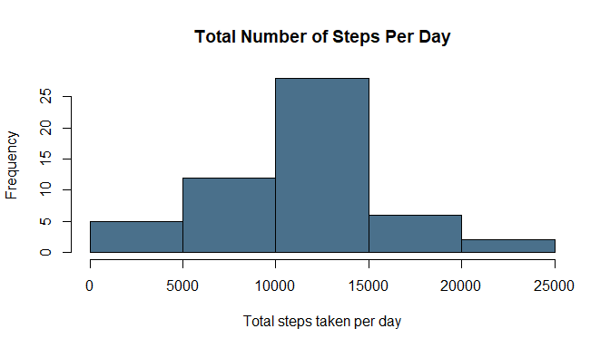
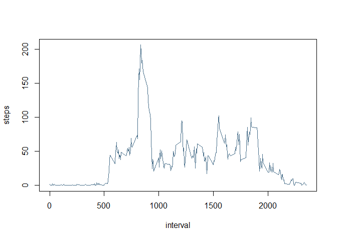
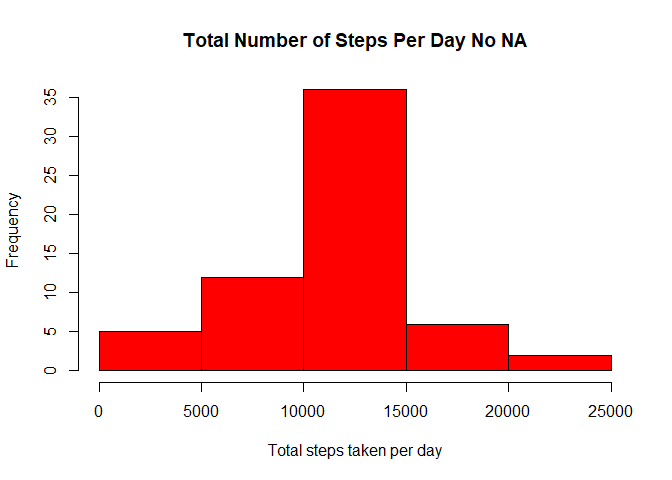
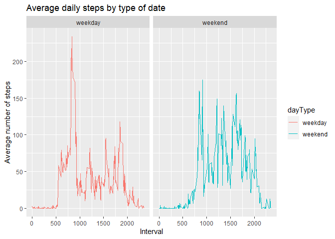

## Loading and preprocessing the data
### [Review this project in Rpub](https://rpubs.com/yeasinopu/Reproducible_Research_Project_1).

```r
unzip("activity.zip")
activityData <- read.csv("activity.csv")
summary(activityData)
```

```
##      steps            date              interval     
##  Min.   :  0.00   Length:17568       Min.   :   0.0  
##  1st Qu.:  0.00   Class :character   1st Qu.: 588.8  
##  Median :  0.00   Mode  :character   Median :1177.5  
##  Mean   : 37.38                      Mean   :1177.5  
##  3rd Qu.: 12.00                      3rd Qu.:1766.2  
##  Max.   :806.00                      Max.   :2355.0  
##  NA's   :2304
```

```r
names(activityData)
```

```
## [1] "steps"    "date"     "interval"
```

```r
head(activityData)
```

```
##   steps       date interval
## 1    NA 2012-10-01        0
## 2    NA 2012-10-01        5
## 3    NA 2012-10-01       10
## 4    NA 2012-10-01       15
## 5    NA 2012-10-01       20
## 6    NA 2012-10-01       25
```

## What is mean total number of steps taken per day?
1. Calculate the total number of steps taken per day

```r
stepPerDay <- aggregate(steps ~ date, activityData, sum, na.rm = F)
```

2. If you do not understand the difference between a histogram and a barplot, research the difference between them. Make a histogram of the total number of steps taken each day

```r
hist(stepPerDay$steps, main = "Total Number of Steps Per Day", xlab = "Total steps taken per day", col = "skyblue4")
```

<!-- -->

3. Calculate and report the mean and median of the total number of steps taken per day  

**Mean**

```r
mean(stepPerDay$steps)
```

```
## [1] 10766.19
```
**Median**

```r
median(stepPerDay$steps)
```

```
## [1] 10765
```


## What is the average daily activity pattern?
1. Make a time series plot (type = "l") of the 5-minute interval (x-axis) and the average number of steps taken, averaged across all days (y-axis)  


```r
# average of intervals
stepsPerInterval<-aggregate(steps~interval, data=activityData, mean, na.rm=TRUE)
plot(steps~interval, data=stepsPerInterval, type="l", col = "skyblue4")
```

<!-- -->

2. Which 5-minute interval, on average across all the days in the dataset, contains the maximum number of steps?


```r
stepsPerInterval[which.max(stepsPerInterval$steps),]$interval
```

```
## [1] 835
```

## Imputing missing values

1. Calculate and report the total number of missing values in the dataset (i.e. the total number of rows with NAs)


```r
sum(is.na(activityData$steps))
```

```
## [1] 2304
```

2. Devise a strategy for filling in all of the missing values in the dataset. The strategy does not need to be sophisticated. For example, you could use the mean/median for that day, or the mean for that 5-minute interval, etc.

Let’s use a simple strategy : we’ll fill in all the missing values in the dataset with the mean per interval. Here’s the function that will return, for a particular interval, the mean value


```r
getMeanStepsPerInterval <- function(interval) {
    stepsPerInterval[which(stepsPerInterval$interval == interval),]$steps
}
```

3. Create a new dataset that is equal to the original dataset but with the missing data filled in.


```r
activityDataNoNA <- activityData
for (i in 1: nrow(activityDataNoNA)) {
    if (is.na(activityDataNoNA[i,]$steps)){
        activityDataNoNA[i,]$steps <-
            getMeanStepsPerInterval(activityDataNoNA[i,]$interval)
    }
}
```

4. Make a histogram of the total number of steps taken each day and Calculate and report the mean and median total number of steps taken per day. Do these values differ from the estimates from the first part of the assignment? What is the impact of imputing missing data on the estimates of the total daily number of steps?


```r
stepPerDayNoNA <- aggregate(steps ~ date, activityDataNoNA, sum, na.rm = T)
hist(stepPerDayNoNA$steps, main = "Total Number of Steps Per Day No NA", xlab = "Total steps taken per day", col = "Red")
```

<!-- -->

**Mean No NA**

```r
mean(activityDataNoNA$steps)
```

```
## [1] 37.3826
```
**Median No NA**

```r
median(activityDataNoNA$steps)
```

```
## [1] 0
```


## Are there differences in activity patterns between weekdays and weekends?
1. Create a new factor variable in the dataset with two levels – “weekday” and “weekend” indicating whether a given date is a weekday or weekend day.

```r
activityData$date<- as.Date(activityData$date)
activityData$day<-weekdays(activityData$date)
activityData$dayType <- NA
for (i in 1 : nrow(activityData)){  
  if (activityData[i,]$day %in% c("Saturday","Sunday" )) {
    activityData[i,]$dayType<- "weekend"
  } else {
    activityData[i,]$dayType<- "weekday"
  }
}
```

2. Make a panel plot containing a time series plot (i.e. type = "l") of the 5-minute interval (x-axis) and the average number of steps taken, averaged across all weekday days or weekend days (y-axis).


```r
library(dplyr)
library(ggplot2)
activity_by_date  <- group_by(activityData, interval,dayType) %>%
  summarise(stepSum = mean(steps, na.rm = T)) %>% as.data.frame
ggplot(activity_by_date, aes(interval, stepSum, color = dayType )) +
  geom_line() +
  facet_wrap(~dayType) +
  labs(title = "Average daily steps by type of date", 
            x = "Interval", y = "Average number of steps")
```

<!-- -->

